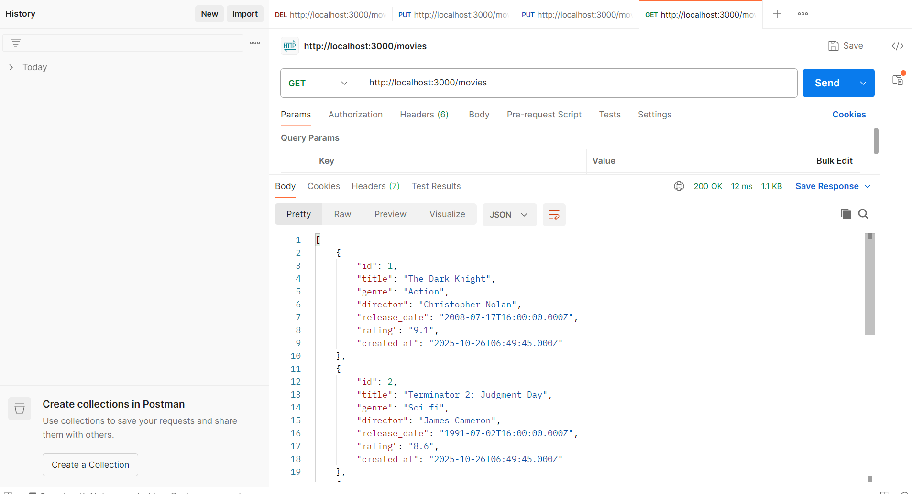
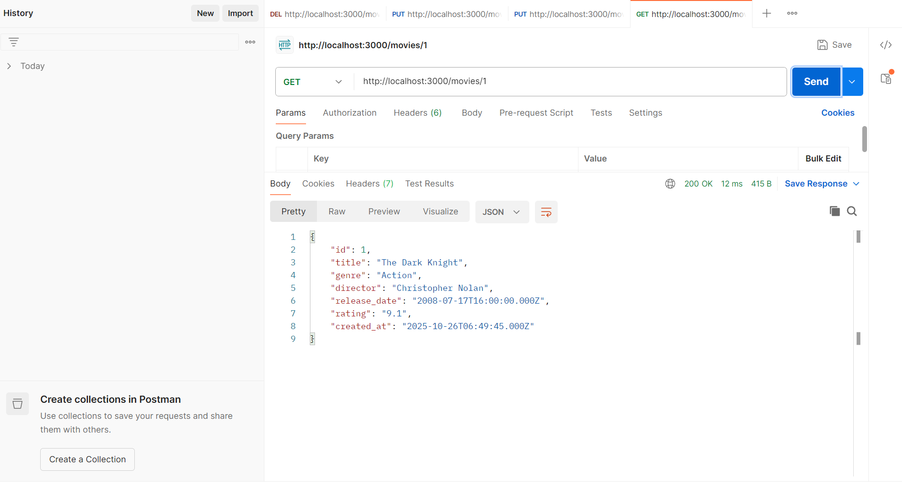
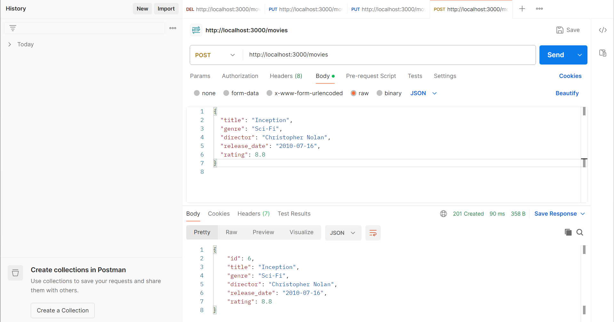
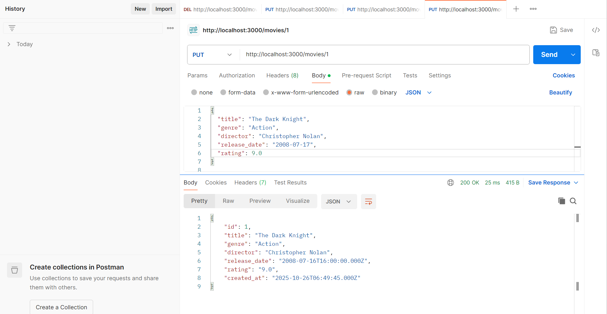
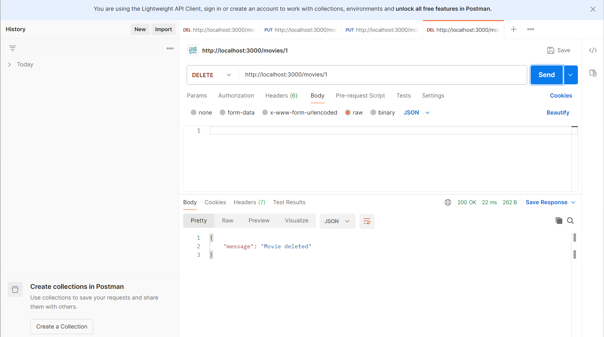

# pwl25-mini-project
##

### Disini kita dapat menampilkan semua data film
##

### Dapat menampilkan detail film berdasarkan ID=1
##

### Dapat menambah data film baru
##

### Dapat mengubah data film ID=1
##

### Dapat menghapus data film ID=1
