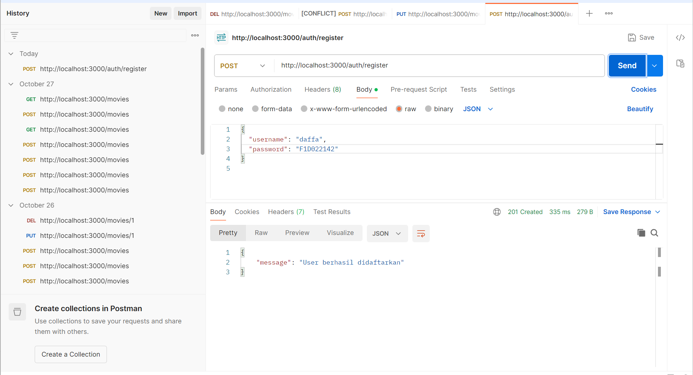
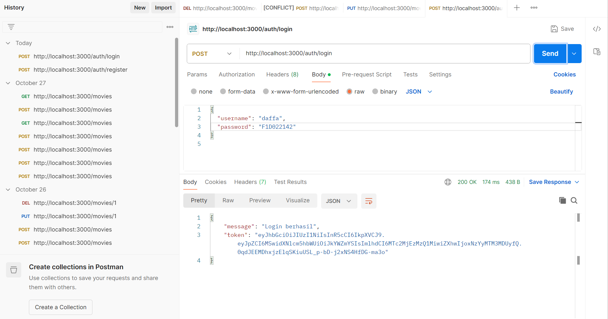
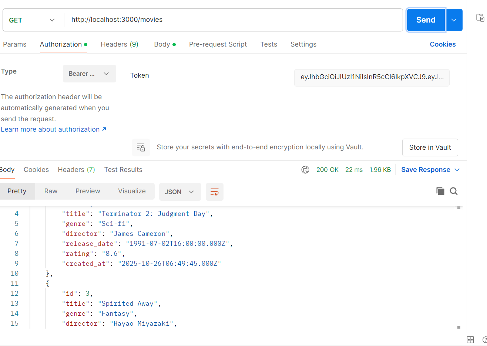
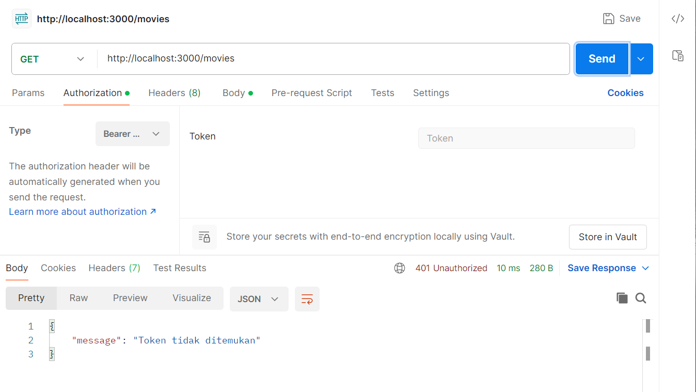

## Tugas week 9 lanjutan mini project, menambahkan authentifikasi pada express
## Fitur utama
- registrasi user baru
- login user dan generate token
- proteksi endpoint "movies" hanya bisa diakses user login
- middleware logger, validate, dan error handler
## Contoh Uji API
### Register

### Login

### Akses Film Menggunakan Token

### Akses Film Tidak Menggunakan Token

## Kesimpulan
Dengan menambahkan autentikasi JWT, API menjadi lebih aman dan hanya dapat diakses oleh pengguna yang memiliki token valid.
